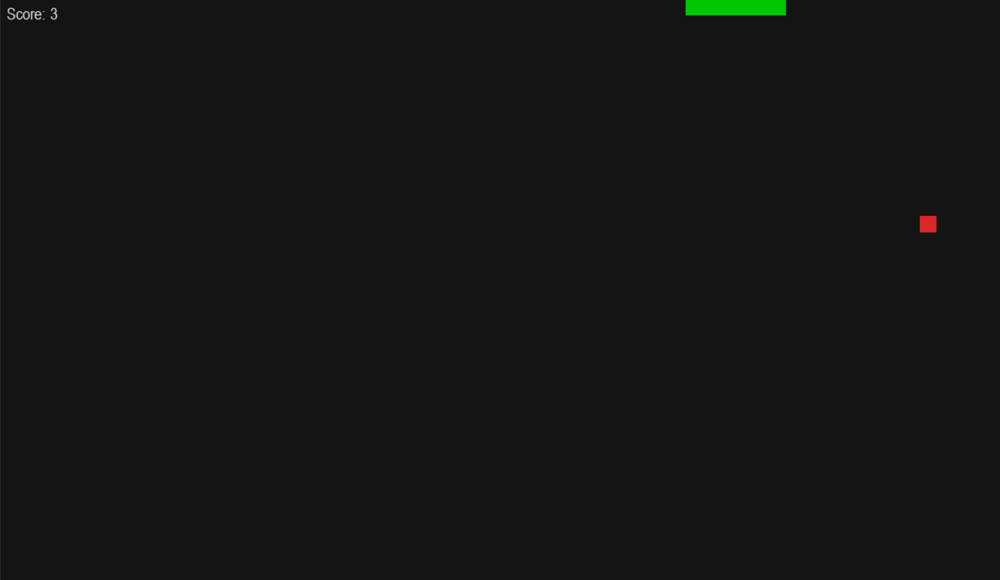
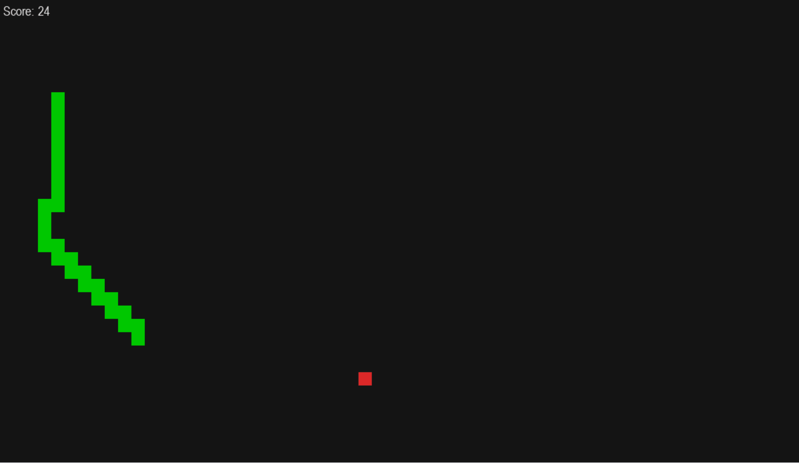
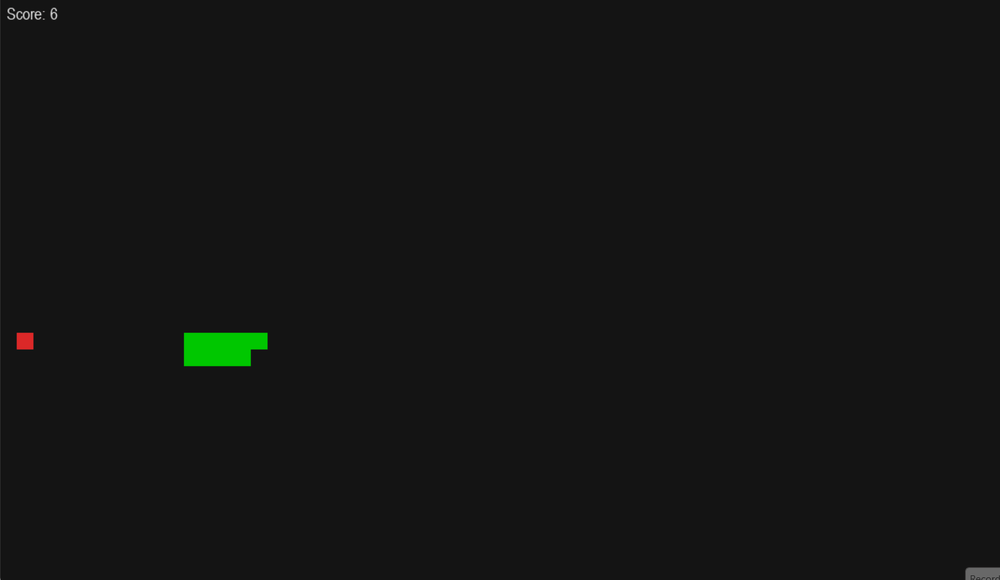

# RLCore (RL Framework)

[](https://www.python.org/)

**A lightweight framework** for training and evaluating **reinforcement learning** agents on classic games such as Snake and Flappy Bird.

## Project Structure

```text
This Repo/
├── checkpoint/              # Weight of agent
│   │── dqn/
│   │     ├── dqn_best.pt
│   │     └── dqn_last.pt
│   │── ppo/
│   │    ├── ppo_pi_last.pt
│   │    └── ppo_v_last.pt
│   └── a2c/
│        ├── (Update Later)
│        └── ...
├── env/                     # Env of game
│   ├── flappy_bird/
│   │   ├── docs.md
│   │   └── flappy_bird.py
│   └── snake/
│       ├── docs.md
│       └── snake.py
├── src/                     # RL algorithm
│   ├── a2c/
│   │   └── a2c.py (update later)
│   ├── ppo/
│   │   ├── core.py
│   │   └── ppo.py
│   └── q_learning/
│       ├── dqn.py
│       └── q_table.py
├── train/                   # Script train
│   ├── train_dqn.py
│   ├── train_flappy_q_table.py
│   └── train_q_table.py
└── ...              # Update later
```

## How To Run

1. Create and activate your environment.

```bash
conda create -n rl_env python=3.10 -y
conda activate rl_env
```

2. Install dependencies.

```bash
pip install torch numpy pygame
```

3. Run training scripts.

```bash
# Q-Table (Snake)
python train/train_snake_q_table.py

# Deep Q-Learning (Snake)
python train/train_snake_dqn.py

# PPO (Snake)
python train/train_snake_ppo.py

# Update later ... :>
```

4. Check saved checkpoints in `checkpoint/` and results in `result/`

## Project Progress

Overall progress: 
- [x] Q-Table
- [x] Deep Q-Learning (DQN)
- [ ] A2C
- [x] PPO

## Benchmark
Average scores over 100 episodes

| Game   | Q Table | DQN | A2C | PP0|
|--------|-----|-----|-----|---|
| Snake  | 16.03 (1000 episodes) | **65.0** (500 episodes) |  | 34.26 (370 episodes)
| Flappy bird   |  |  |  | 

## Demos

### Snake
- Q Table (1000 episodes)

- Deep Q-Learning (500 episodes)

- PPO (414 episodes)


### Flappy Bird

Update later :>

## License

This project is licensed under the Apache License 2.0.

See the `LICENSE` file at the project root for full license text.
